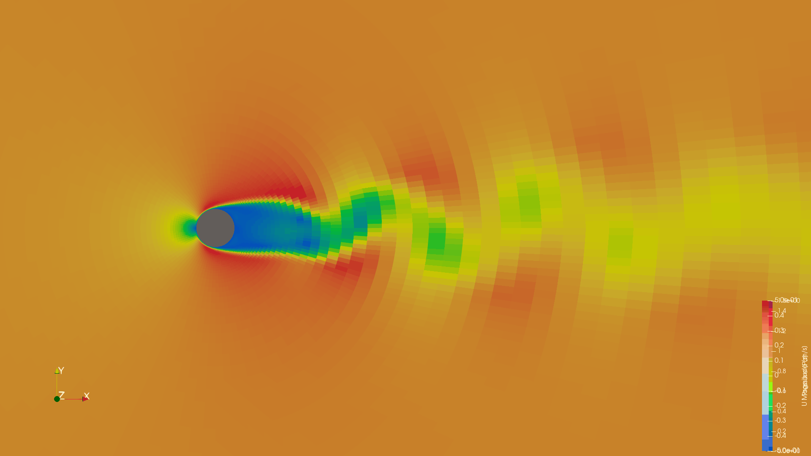

# CFD Exercises

<p align="center">
  
  
  [](https://opensource.org/licenses/MIT)
  [](https://www.mathworks.com/products/matlab.html)
  [](https://www.openfoam.com/)
  [](https://www.overleaf.com/)
  [](https://www.docker.com/)
  [](https://www.apple.com/macos/)
  [](https://www.unileon.es/)
</p>



This repository contains the implementation of 7 CFD (Computational Fluid Dynamics) exercises as part of a Master's level aerospace engineering class at Universidad de León. The work includes MATLAB scripts for analytical methods and OpenFOAM cases for numerical simulations.

## Project Structure

- **00_Enunciados/**: Problem statements and professor's notes
- **01_Matlab_Exercises/**: MATLAB scripts for Exercises 1-3 (Hess-Smith, Multhopp, Vortex Lattice methods)
- **02_OpenFOAM_FVM/**: OpenFOAM cases for Exercises 4-7 (FVM, shock tube, Couette flow, cylinder flow)
- **03_Docker/**: Docker environment setup for OpenFOAM reproducibility
- **04_Report_LaTeX/**: LaTeX source for the final report

## Exercises Description

- **Exercise 1: Hess-Smith Panel Method** - MATLAB implementation of the Hess-Smith method for calculating potential flow around 2D airfoils using source and vortex panels to determine pressure distribution and aerodynamic coefficients.

- **Exercise 2: Multhopp Method** - MATLAB application of the Multhopp method for aerodynamic analysis of finite wings, modeling the wing as a system of horseshoe vortices to compute lift distribution and induced drag.

- **Exercise 3: Vortex Lattice Method** - MATLAB development of a Vortex Lattice method for 3D wing analysis, discretizing the wing surface into panels with bound vortices to calculate lift, drag, and moment coefficients.

- **Exercise 4: Finite Volume Method and Shock Tube** - OpenFOAM simulations with MATLAB post-processing for implementing and comparing numerical schemes in 1D scalar transport equations, plus simulation of the Sod shock tube problem to study shock wave propagation, contact discontinuities, and rarefaction waves.

- **Exercise 5: Planar Couette Flow** - OpenFOAM simulations with MATLAB post-processing for analyzing laminar and turbulent Couette flow between parallel plates at different Reynolds numbers, including the implementation and validation of wall functions.

- **Exercise 6: Flow Around a Cylinder (Mesh Convergence)** - OpenFOAM simulations with MATLAB post-processing for studying mesh convergence in steady incompressible flow around a circular cylinder at various Reynolds numbers, analyzing aerodynamic coefficients and flow patterns.

- **Exercise 7: Von Kármán Vortex Street** - OpenFOAM simulations with MATLAB post-processing for time-dependent flow around a circular cylinder, focusing on vortex shedding, aerodynamic coefficients, and the formation of the Von Kármán vortex street.

## Docker Setup

This project uses Docker for maximum reproducibility of OpenFOAM simulations. The complete environment is saved as a Docker image tar file.

### Environment Details

- **Base Image**: microfluidica/openfoam:13 (ARM64 for Mac M1)
- **Size**: ~465 MB (compressed)
- **OpenFOAM Version**: 13
- **Architecture**: ARM64 (Apple Silicon compatible)

## Software and Hardware used

- M1 Macbook Pro 16 GB RAM macOS 26.1
- MATLAB R2025
- OpenFOAM 13 (via Docker)
- ParaView
- LaTeX 


## License

This work is submitted as part of a university assignment. The base OpenFOAM cases are provided by the professor. For academic purposes, MIT License is used

```
MIT License

Copyright (c) 2025 Miguel Rosa

Permission is hereby granted, free of charge, to any person obtaining a copy
of this software and associated documentation files (the "Software"), to deal
in the Software without restriction, including without limitation the rights
to use, copy, modify, merge, publish, distribute, sublicense, and/or sell
copies of the Software, and to permit persons to whom the Software is
furnished to do so, subject to the following conditions:

The above copyright notice and this permission notice shall be included in all
copies or substantial portions of the Software.

THE SOFTWARE IS PROVIDED "AS IS", WITHOUT WARRANTY OF ANY KIND, EXPRESS OR
IMPLIED, INCLUDING BUT NOT LIMITED TO THE WARRANTIES OF MERCHANTABILITY,
FITNESS FOR A PARTICULAR PURPOSE AND NONINFRINGEMENT. IN NO EVENT SHALL THE
AUTHORS OR COPYRIGHT HOLDERS BE LIABLE FOR ANY CLAIM, DAMAGES OR OTHER
LIABILITY, WHETHER IN AN ACTION OF CONTRACT, TORT OR OTHERWISE, ARISING FROM,
OUT OF OR IN CONNECTION WITH THE SOFTWARE OR THE USE OR OTHER DEALINGS IN THE
SOFTWARE.
```
